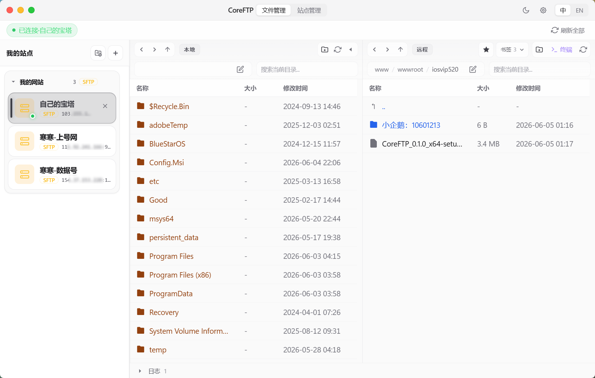
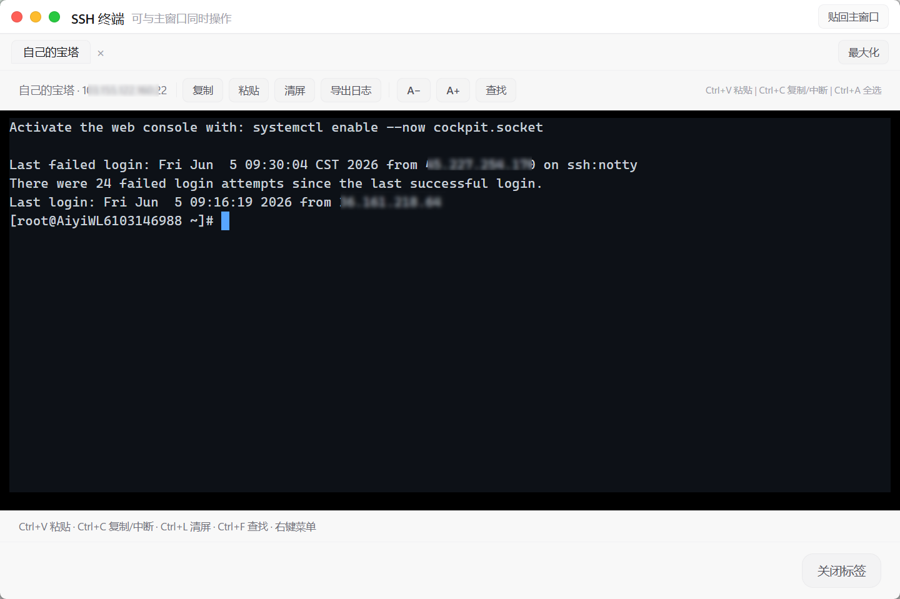
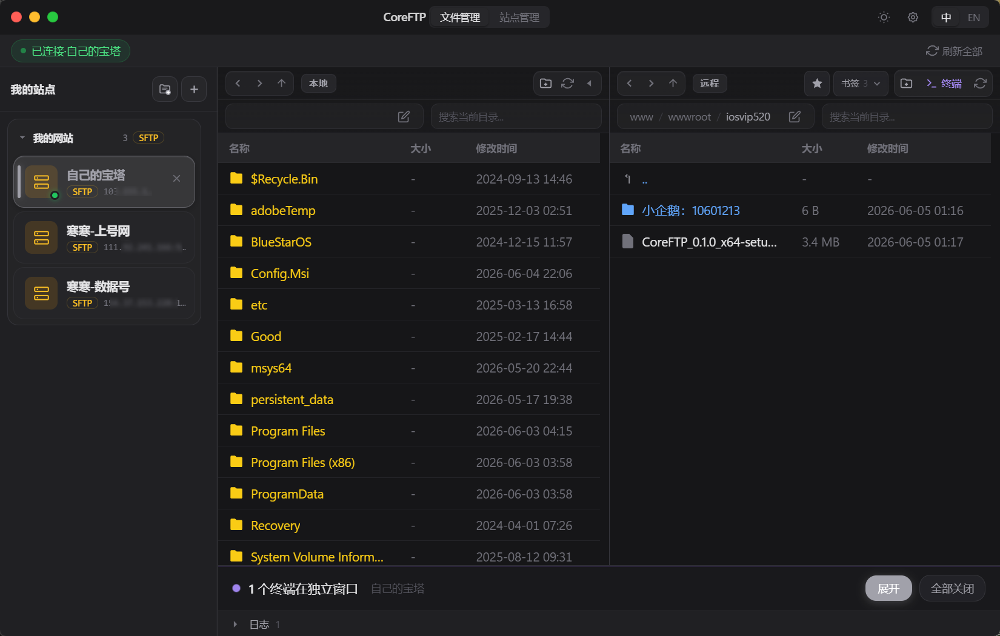
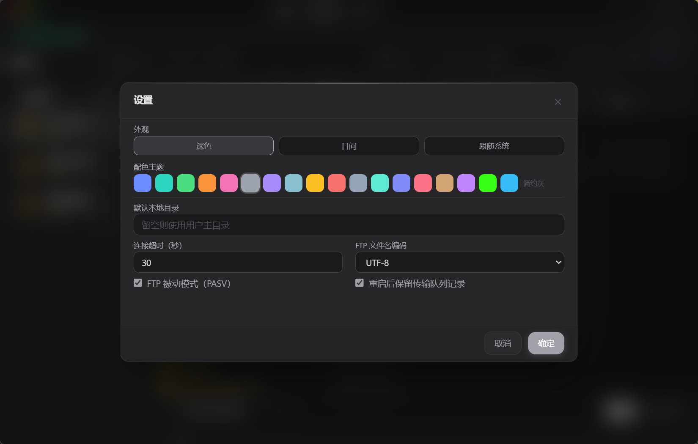
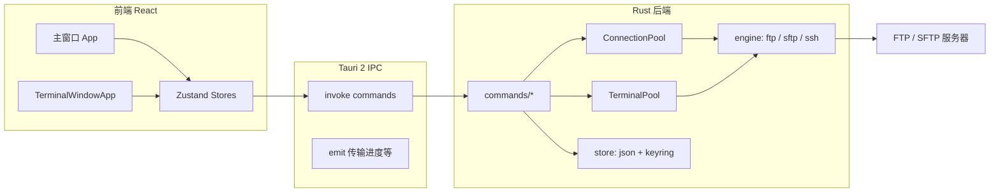

# CoreFTP

> 基于 [Tauri 2](https://tauri.app) + React 的桌面 FTP/SFTP 客户端，支持双栏文件管理、传输队列、远程解压与 SSH 终端。

[GitHub](https://github.com/milusvip/CoreFTP)
[Tauri](https://tauri.app)
[React](https://react.dev)
[Platform](https://github.com/milusvip/CoreFTP)

## 软件截图

### 主界面

双栏文件管理、侧栏站点分类与底部传输队列。



### SSH 终端

内嵌多标签终端或独立 SSH 窗口，支持查找、导出与字体缩放。



### 站点管理

分类分组、批量连接/断开/删除，密码与私钥口令由系统凭据管理器保管。



### 夜间模式

深色主题与多套配色（经典蓝、海洋、森林等），标题栏可快速切换明暗。



## 功能概览

### 连接与协议

- **FTP / FTPS / SFTP / SSH**（密码或 SSH 私钥 + 口令）
- **主机密钥校验**：首次连接显示 `SHA256` 指纹，写入本地 `known_hosts`
- 连接超时、FTP 被动模式、编码（含 GBK）等可在设置中调整

### 文件管理（双栏）

- 本地 / 远程并列浏览，路径面包屑、历史前进后退
- 上传 / 下载（文件与目录）、拖放、覆盖确认（跳过 / 全部跳过 / 覆盖 / 全部覆盖）
- 新建文件夹、重命名、删除（含递归删除目录）
- 本地 / 远程**深度搜索**；远程**书签**收藏常用路径
- 压缩包（zip / tar.gz 等）在列表中有醒目标识

### 传输与运维

- 传输队列：进度、速度、取消 / 重试；可选**队列持久化**
- 远程 **zip/tar.gz 解压**（可选解压后删除原包）；上传任务去重，避免重复上传
- 上传后可按站点配置 **chown / chmod 755**（默认属主 `www`）
- **目录同步**：将缺失文件上传到远程，或下载到本地（可选删除多余项）

### 远程编辑

- 右键「用系统默认程序编辑」：下载到临时目录 → 保存后回传服务器

### SSH 终端

- 基于 **xterm.js**：多标签、全屏、查找、导出 `.log`、字体缩放
- 内嵌主窗口或**独立窗口**；侧栏站点右键可**直接打开独立 SSH 窗口**
- 底部 Dock 显示运行中终端数量；关闭标签 / 窗口 / 全部关闭前**二次确认**

### 站点管理

- 侧栏**分类**分组；分类标题显示组内协议标签（SFTP、SSH 等）
- **站点管理**面板：批量模式（全选、批量连接/断开/删除、移到分类）；**空分类**也可勾选删除
- 密码与私钥口令存入 **Windows 凭据管理器**（服务名 `core-ftp`）

### 界面

- 自定义标题栏（类 macOS 交通灯）
- **日间 / 深色 / 跟随系统**，6 套配色（经典蓝、海洋、森林、日落、玫瑰、简约灰）
- 中英文界面切换

## 技术与架构

### 技术栈


| 层级      | 技术                                              | 说明                                                            |
| ------- | ----------------------------------------------- | ------------------------------------------------------------- |
| 桌面壳     | Tauri 2                                         | 双窗口（`main` / `ssh-terminal`），无系统装饰自定义标题栏                      |
| 前端      | React 19、TypeScript、Vite 6、Tailwind CSS 3       | SPA，`?view=terminal` 路由独立终端页                                  |
| 状态      | Zustand                                         | `siteStore`、`transferStore`、`terminalStore`、`settingsStore` 等 |
| 终端 UI   | @xterm/xterm + Fit / Search                     | 经 Tauri 事件接收后端 PTY 输出                                         |
| 协议 · 传输 | **suppaftp**（FTP/FTPS）、**ssh2**（SFTP/SSH/Shell） | 阻塞 I/O 在 `spawn_blocking` 中执行                                 |
| 凭据      | **keyring**                                     | Windows / macOS 原生钥匙串，服务名 `core-ftp`                          |
| 序列化     | serde / serde_json                              | 站点、设置、书签、队列快照                                                 |
| 异步运行时   | Tokio                                           | 连接保活、传输进度事件、终端读写                                              |


### 整体架构




- 前端通过 `@tauri-apps/api` 的 `invoke` 调用 Rust 命令；传输进度等由后端 `emit` 到前端监听。
- 每个站点在 `ConnectionPool` 中对应一条 FTP 或 SFTP 连接（`Arc<Mutex<...>>`），断开时释放并停止 Tokio 保活任务。
- SSH 交互终端由 `TerminalPool` 管理独立 PTY 会话，与 SFTP 文件连接可并存（同站点复用 SSH 会话逻辑见 `engine/ssh_session.rs`）。

### 项目结构

```
CoreFTP/
├── src/                      # 前端
│   ├── App.tsx               # 主界面：双栏文件、侧栏、队列、对话框
│   ├── main.tsx              # 入口；区分主窗口 / ssh-terminal 窗口
│   ├── components/           # UI 组件（FilePanel、Sidebar、终端等）
│   ├── stores/               # Zustand（站点、传输、终端、设置）
│   ├── i18n/                 # 中英文文案
│   └── theme/                # CSS 变量主题（themes.css）
├── src-tauri/
│   ├── tauri.conf.json       # 窗口、打包、权限能力
│   ├── Cargo.toml
│   └── src/
│       ├── lib.rs            # Tauri Builder、命令注册、全局 State
│       ├── commands/         # IPC 命令层
│       │   ├── files.rs      # 连接、列目录、搜索
│       │   ├── transfer.rs   # 上传/下载/删除、进度
│       │   ├── extract.rs    # 上传并解压、远程解压
│       │   ├── terminal.rs   # PTY 打开/写/resize/关闭
│       │   ├── sync.rs       # 目录镜像同步
│       │   ├── edit.rs       # 远程文件本地编辑回传
│       │   └── sites.rs / settings.rs / bookmarks.rs
│       ├── engine/           # 协议实现
│       │   ├── ftp.rs        # FTP/FTPS（suppaftp + native-tls）
│       │   ├── sftp.rs       # SFTP 文件操作
│       │   ├── ssh.rs        # SSH 命令执行（解压、chown 等）
│       │   ├── known_hosts.rs
│       │   └── remote_ops.rs # 删除/递归下载等统一入口
│       └── store/            # 本地持久化
│           ├── sites.rs      # sites.json + 凭据
│           ├── settings.rs
│           ├── bookmarks.rs
│           └── credentials.rs
├── scripts/tauri-dev.ps1     # Windows 下注入 MSVC 环境后启动 dev
└── package.json
```

### 后端要点


| 模块                    | 职责                                                                                              |
| --------------------- | ----------------------------------------------------------------------------------------------- |
| `commands::files`     | `connect_server` / `disconnect_server`、`list_remote_files`、深度搜索；维护 `ConnectionPool` 与 keepalive |
| `commands::transfer`  | 分块上传下载、`remote_file_exists`、覆盖策略由前端控制；支持 `cancel_transfer`                                      |
| `commands::extract`   | 本地 zip/tar.gz 上传后远程 `unzip`/`tar`；或远程已有包解压                                                      |
| `commands::terminal`  | `terminal_open` / `write` / `resize` / `close`；独立窗口 `show_terminal_window`                      |
| `commands::sync`      | 对比本地与远程目录树，批量补传或补下                                                                              |
| `engine::permissions` | 上传后 `chown`/`chmod`（站点可配置属主）                                                                    |


长时间阻塞的 SFTP/FTP 操作放在 `tokio::task::spawn_blocking` 中，避免卡住异步运行时；结果以 `Result<T, String>` 返回前端展示。

### 前端要点


| 模块              | 职责                                        |
| --------------- | ----------------------------------------- |
| `siteStore`     | 站点列表、连接状态、`currentPath`、远程文件列表            |
| `transferStore` | 任务队列、进度监听、覆盖对话框、持久化恢复                     |
| `terminalStore` | 多标签终端、内嵌/独立窗口、与 `terminalStoreSync` 跨窗口同步 |
| `settingsStore` | 超时、编码、主题、默认本地路径等                          |


主题通过 `data-appearance` / `data-theme` 与 `src/theme/themes.css` 中 CSS 变量切换，不依赖运行时换肤库。

### 安全与本地数据

- 站点 JSON **不保存明文密码**；密码与私钥口令仅存系统钥匙串。
- 首次 SSH/SFTP 连接校验主机密钥指纹，用户确认后写入 `known_hosts`。
- Tauri capability 在 `src-tauri/capabilities/` 中按窗口限定 FS、对话框、剪贴板等权限。

## 环境要求

- **Node.js** 18+
- **Rust** stable
- **Windows**：Visual Studio 2022 Build Tools，勾选「使用 C++ 的桌面开发」（提供 `cl.exe`）
- **macOS**：Xcode Command Line Tools（编译 SFTP 依赖）

## 快速开始

```bash
git clone https://github.com/milusvip/CoreFTP.git
cd CoreFTP
npm install
```

开发运行（推荐，自动配置 MSVC 环境）：

```powershell
npm run tauri:dev
```

Windows 也可双击根目录 `**tauri-dev.bat**`（需已安装 VS 2022 Build Tools）。

> 请勿在普通 PowerShell 中直接执行 `npm run tauri dev`，否则可能找不到 `cl.exe`。

仅构建前端：

```bash
npm run build
```

## 打包发布

在 **VS 2022 x64 Native Tools Command Prompt** 中执行：

```powershell
npm run tauri build
```


| 产物        | 路径                                                                |
| --------- | ----------------------------------------------------------------- |
| 便携 EXE    | `src-tauri/target/release/CoreFTP.exe`                            |
| 安装包 (MSI) | `src-tauri/target/release/bundle/msi/CoreFTP_0.1.0_x64_en-US.msi` |


版本号以 `package.json` / `src-tauri/tauri.conf.json` 为准。

## 配置与数据目录

Windows 下数据默认位于 `%LOCALAPPDATA%\CoreFTP\`：


| 内容              | 文件                       |
| --------------- | ------------------------ |
| 站点列表            | `sites.json`             |
| 分类              | `categories.json`        |
| 应用设置            | `settings.json`          |
| 书签              | `bookmarks.json`         |
| 传输队列快照          | `transfers.json`（开启持久化时） |
| SSH known_hosts | `known_hosts`            |
| 密码 / 私钥口令       | 系统凭据管理器 `core-ftp`       |


## 使用提示

1. **连接**：侧栏点击站点；双击连接。右键可编辑、断开、删除；**SSH 独立窗口**可从右键菜单打开。
2. **分类**：侧栏「文件夹 +」新建分类；分类行右侧 `+` 可在该分类下添加站点。
3. **远程面板**：★ 书签；工具栏 **同步**、**终端**（SFTP/SSH 且已连接时）。
4. **传输**：拖入本地文件到远程面板上传；底部传输队列可展开查看进度。
5. **解压**：远程 zip/tar.gz 右键解压，可选解压后删除原包。
6. **设置**：标题栏齿轮 — 主题、超时、被动模式、默认本地路径、队列持久化等；太阳/月亮图标快速切换明暗。
7. **站点管理**：标题栏「站点」— 批量操作、搜索、按分类折叠管理。
8. **调试**：主窗口 **F12** 打开 WebView2 开发者工具（`tauri.conf.json` 中 `devtools: true`）。

## 开发与贡献


| 命令                    | 说明                                          |
| --------------------- | ------------------------------------------- |
| `npm run dev`         | 仅 Vite 前端（端口见 `tauri.conf.json` → `devUrl`） |
| `npm run tauri:dev`   | 推荐：PowerShell 脚本加载 MSVC 后 `tauri dev`       |
| `tauri-dev.bat`       | Windows：双击启动 dev（同上，需 Build Tools）          |
| `npm run build`       | `tsc` + 生产前端产物到 `dist/`                     |
| `npm run tauri build` | 前端 build + Rust release + 安装包               |
| `npm run icons`       | 从 `src-tauri/icons/logo.png` 生成各平台应用图标     |


修改 Rust 命令后需在 `src-tauri/src/lib.rs` 的 `generate_handler![]` 中注册；前端类型与 `invoke` 名称需与命令一致。

## 安全提示

仓库地址：[https://github.com/milusvip/CoreFTP](https://github.com/milusvip/CoreFTP)

密码与私钥口令保存在系统凭据管理器，**不会**进入源码或安装包。`.gitignore` 已忽略 `sites.json`、`settings.json`、`known_hosts` 等本地配置文件（含主机名、用户名、私钥路径），请勿手动 `git add -f` 强制提交；也不要把 `%LOCALAPPDATA%\CoreFTP\` 拷进项目目录。

## 许可证

尚未在仓库中附带 LICENSE 文件。可在 [GitHub 仓库](https://github.com/milusvip/CoreFTP) 中自行添加（例如 MIT / Apache-2.0）并在本段注明。

## 致谢

- [Tauri](https://tauri.app)
- [xterm.js](https://xtermjs.org/)

